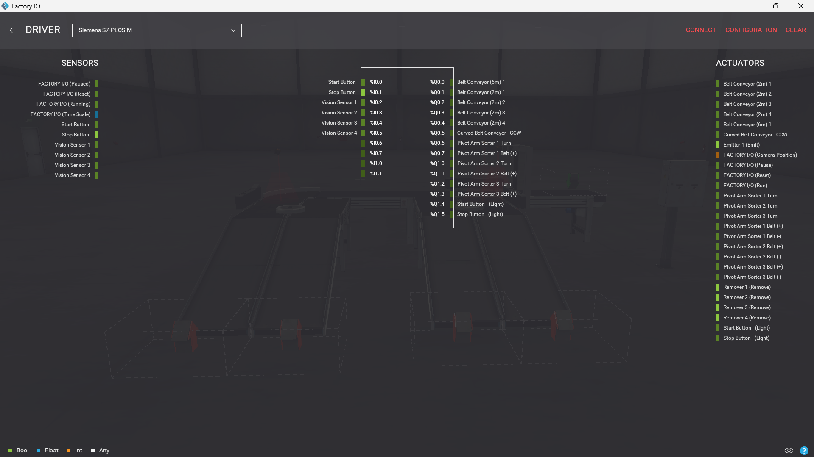
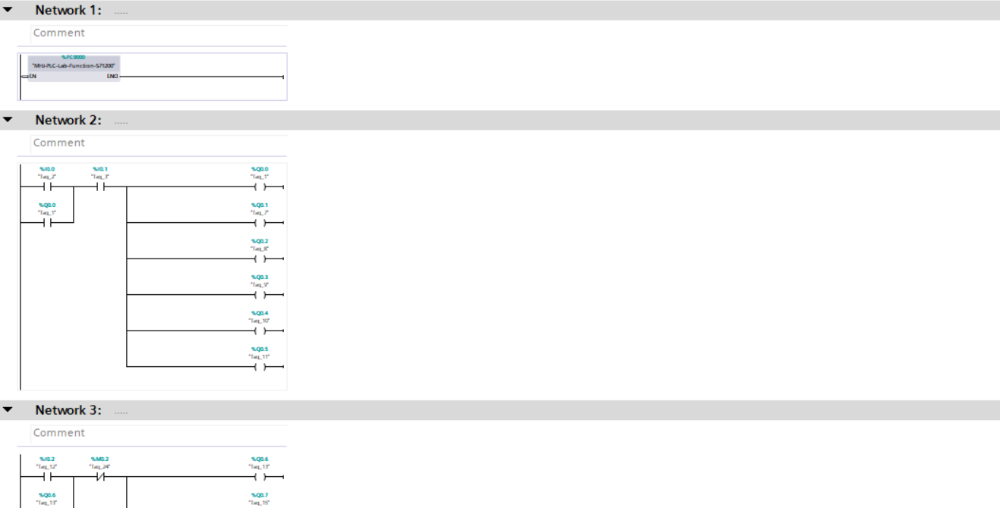
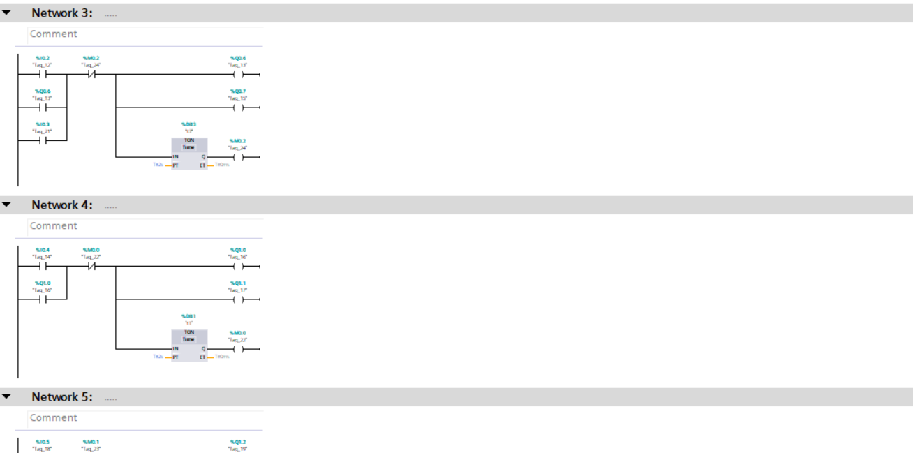
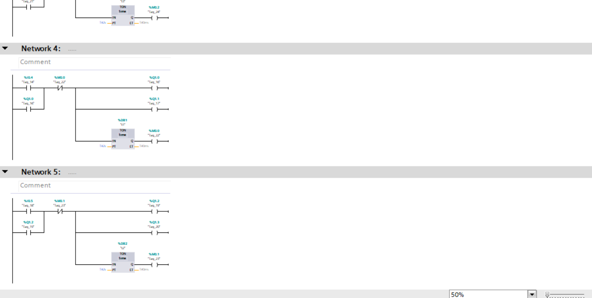
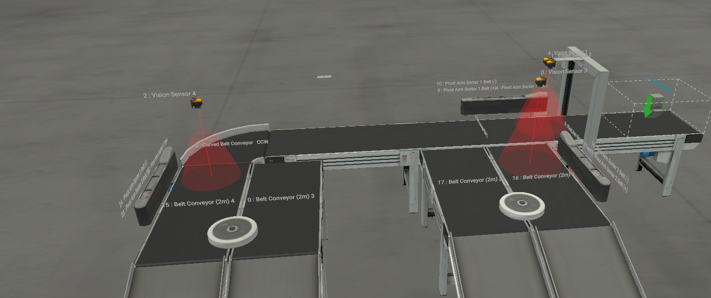

# PLC-Automated-Sorting-System-by-Shape-and-Color

##  Project Overview
This project presents a fully automated industrial sorting system developed using **Siemens TIA Portal** and simulated in **Factory I/O**.  

The system detects different products using Vision Sensors and automatically sorts them into designated lanes using Pivot Arm mechanisms and conveyor systems.

---

##  Technologies Used
- **PLC Programming:** Siemens TIA Portal (S7-1200)
- **Simulation:** Factory I/O
- **PLC Simulation:** Siemens S7-PLCSIM
- **Programming Language:** Ladder Diagram (LAD)

---

##  Control Logic Highlights
The control system follows industrial best practices and includes:

- **Latching Logic:** Stable ON/OFF control for conveyor motors  
- **Sensor-Based Decisions:** Vision sensors trigger sorting actions in real-time  
- **Timers (TON):** Synchronization between conveyor motion and sorting arms  
- **Safety Interlocking:**  
  - Emergency Stop overrides all operations  
  - Safe system shutdown on Stop command  

---

##  Project Preview

###  Driver Configuration

###  Ladder Logic Implementation
  
  

###  Factory I/O Scene

---

##  Demo Video
 [Watch the simulation video](Video.mp4)

---

##  Project Files Included
- TIA Portal Project File  
- Factory I/O Scene File  
- PLC Logic Screenshots  
- Simulation Video  

---

##  How to Run the Project
1. Open the project in **TIA Portal**
2. Start **S7-PLCSIM**
3. Open the scene in **Factory I/O**
4. From `File > Drivers`, select **S7-PLCSIM** and ensure connection is active
5. Run the simulation and press **Start**
